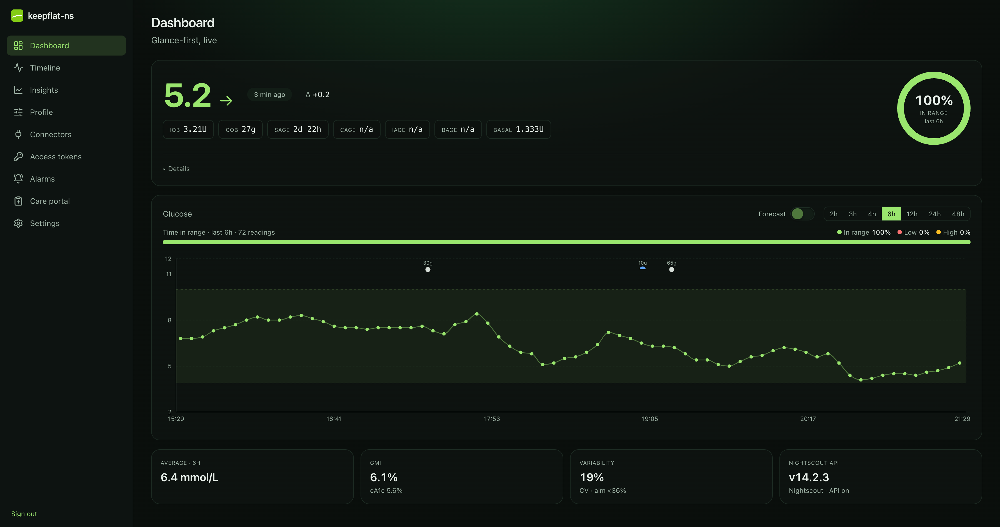
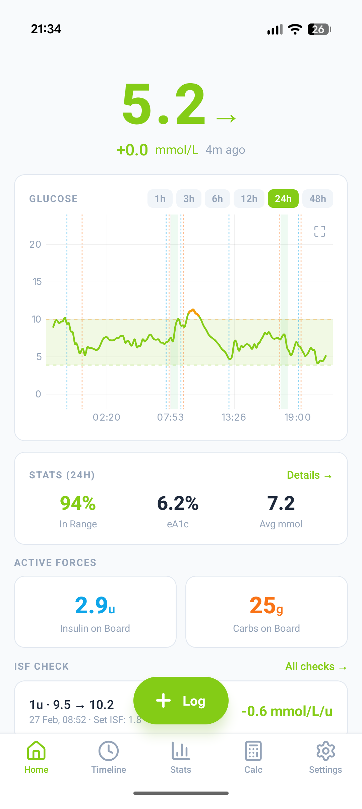
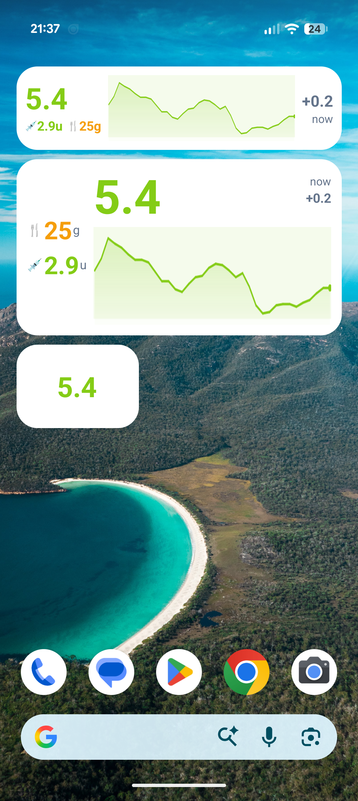
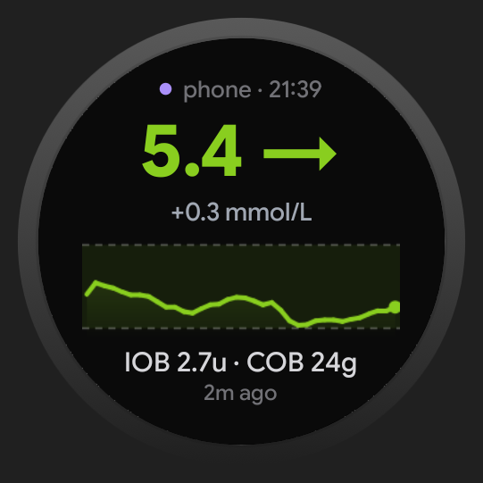
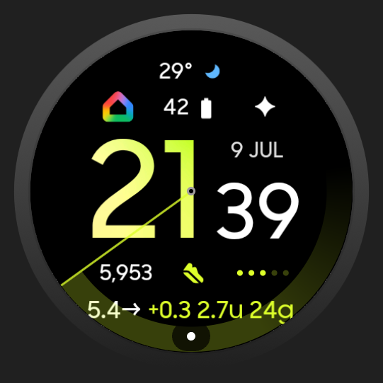
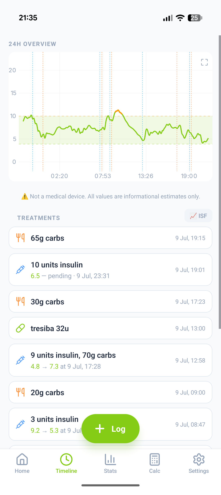
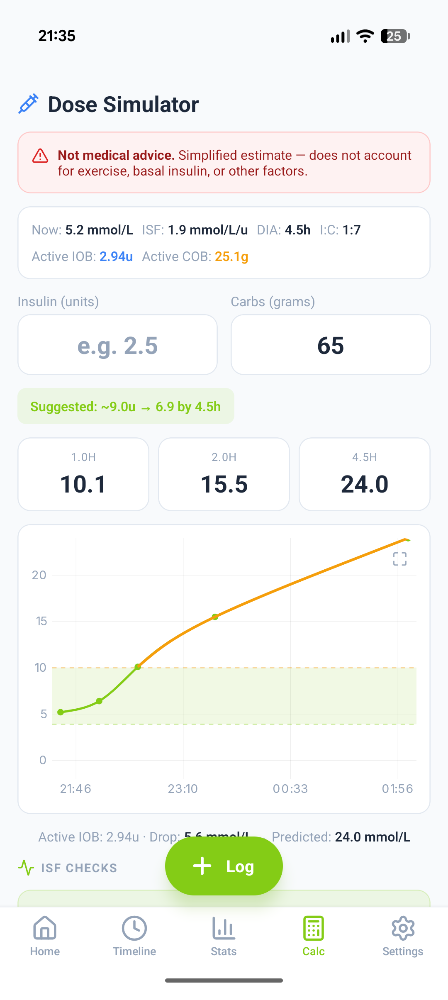
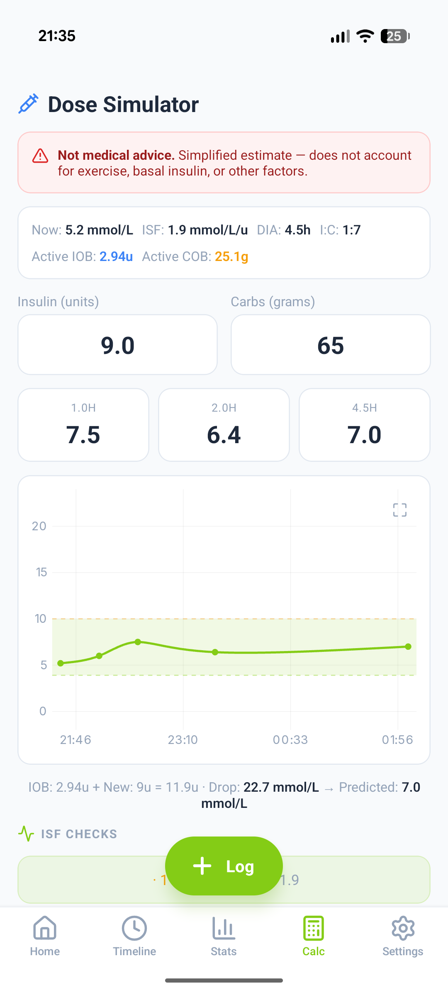
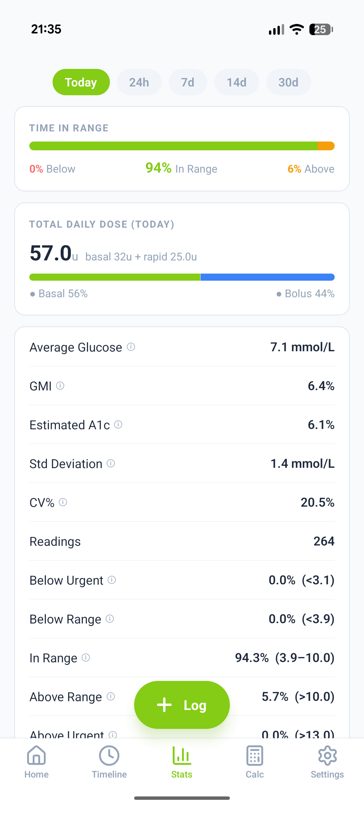
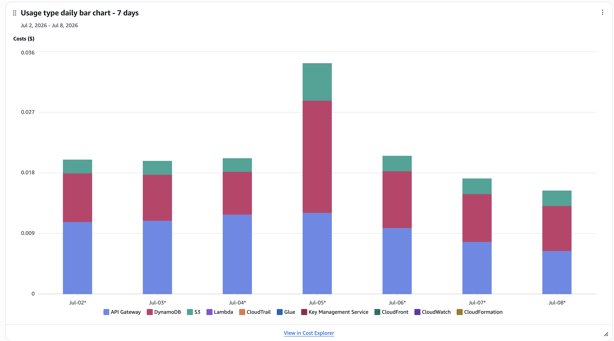

# Scale-to-Zero, Contract-First: Rebuilding a Nightscout-Compatible CGM Platform with Smithy and Kiro CLI

*An educational write-up of a personal project: what I built across cloud, web, mobile and watch, why I chose Smithy, and how [Kiro CLI](https://kiro.dev) turned months of work into evenings.*

> **Disclaimer — education only.** This is a personal learning project, not a medical device, and nothing here is medical advice. Any diabetes-related values (like "insulin on board") are informational estimates only — never dosing guidance. I'm not sharing the source code; the screenshots are of my own build. Nightscout is a community, open-source project that this learns from and stands on the shoulders of.

---

## What is Nightscout?

If diabetes touches your life, you may already know [Nightscout](https://github.com/nightscout/cgm-remote-monitor) ("NS"). It's a beloved open-source project, born from the #WeAreNotWaiting movement, that takes the readings from a Continuous Glucose Monitor (CGM) and lets you see them anywhere: a phone, a watch face, a browser, a bedside display.

Under the hood it's a Node.js server backed by MongoDB, exposing a REST API. Endpoints like `/entries` (glucose readings) and `/treatments` (insulin, carbs). A whole ecosystem of apps, watch faces and data uploaders is built around that API. It's brilliant. It also means running and paying for an always-on server and database.

## Why this is personal

I don't come at this in the abstract. I live with type 1 diabetes. Before Nightscout, my glucose data mostly sat in a vendor app I'd open now and then. Nightscout put it everywhere I already look: my phone, a widget, my watch face, and next to what I'd actually eaten and dosed.

That turned out to matter more than I expected. Being in the know is what let me take control. Seeing the trend and the context, rather than a single number, meant I could act earlier and start to understand what my body was really doing. The data had always been there. Nightscout is what made it useful, and staying on top of it day to day has kept me more in control than I was before.

That's my own experience, not a medical claim. Everyone's different, and none of this replaces your care team. But it's the honest reason I spent evenings rebuilding this: the tool made a real difference to me, and I wanted to understand it from the inside.

## Why try it in a "serverless world"?

Two reasons. One practical, one just curiosity.

The practical one: an always-on Node + Mongo host costs money and needs looking after. CGM data is tiny and bursty - one reading every five minutes. That's close to a textbook case for serverless: the compute scales to zero between requests, and the few managed services left running cost very little at this level.

The curious one: could I rebuild a compatible API, one that existing Nightscout apps could talk to unchanged, entirely on managed AWS pieces? And what would it cost? The answer was: pennies a month, which genuinely surprised me.

The goal was never to replace Nightscout. It was to learn, and to see how far a modern, contract-first, serverless approach could go.

## What is Smithy - and why I chose it

This is the part I most wanted to write about, because it's oddly under-documented.

[Smithy](https://smithy.io) is an Interface Definition Language. It's a formal way to describe an API - its operations, inputs, outputs, errors and types - independent of any language or protocol. It's the same technology AWS uses internally to define its own services. You write the model once, then generate things from it: typed server code, client SDKs, and an OpenAPI document.

Why Smithy instead of hand-writing an Express app, or starting from OpenAPI? A few reasons:

- **One source of truth.** The contract lives in the model. The server types, request validation and the OpenAPI spec are all generated from it, so they can't quietly drift apart.
- **Contract-first discipline.** You decide the shape of each endpoint before you write a line of behaviour.
- **It fits serverless neatly.** The generated OpenAPI drives API Gateway, and each operation gets its own small Lambda, which is great for isolation and per-endpoint observability.

The mental model is: Smithy model → code generation → (typed handlers + OpenAPI) → API Gateway + Lambdas + a database. For storage I used DynamoDB with a single-table design. For auth, Cognito, so every record is scoped to its owner. I kept Nightscout's v1/v3 shapes for compatibility and added a clean v4 surface, deliberately echoing the Nightscout Foundation's newer [Nocturne](https://github.com/nightscout/nocturne) work instead of inventing my own conventions.

## It wasn't just an API - it was the whole vertical

The backend was only one layer. Over the same project the stack grew to cover every surface a person actually uses to check their glucose:

- **The serverless backend** - Smithy + Lambda + DynamoDB + Cognito.
- **A web dashboard** - a React single-page app: live charts, time-in-range, insulin/carb context, a glucose forecast. Deployed as static files behind a CDN.
- **A native Android app** - Expo / React Native on the surface, but with real native Kotlin modules underneath: home-screen widgets in three sizes with a rendered sparkline, a foreground service that polls independently, high/low alerts, Health Connect read/write, ingest from local CGM apps (Juggluco / xDrip+) and Dexcom notifications, and over-the-air JS updates.
- **A Wear OS surface** - a watch-face complication (glucose, trend, insulin-on-board) and a tile with a graph, drawn as a bitmap sparkline and fed from the phone over the Wear Data Layer.

Any one of those is a project on its own. Together they cover four ecosystems - AWS, the browser, Android native, and Wear OS - each with its own conventions, build tooling and sharp edges.

<figure><figcaption>The web dashboard - live glucose, time-in-range, IOB/COB and a forecast, deployed behind a CDN.</figcaption></figure>

<figure><figcaption>The Android app home screen - 24h chart, active forces (IOB/COB) and headline stats.</figcaption></figure>

<figure><figcaption>Home-screen widgets in three sizes, each with a live sparkline.</figcaption></figure>

<figure><figcaption>The Wear OS glucose tile - value, trend, delta, IOB/COB and a sparkline.</figcaption></figure>
<figure><figcaption>And a watch-face complication. Both are fed from the phone over the Wear Data Layer.</figcaption></figure>

One thing ties all of that together: the maths is defined once and mirrored on every surface. The logic that estimates insulin-on-board, carbs-on-board and the forecast follows the same equations and parameters on the web, in the phone app, in the native widget and on the watch. Keeping them in step turned out to be quietly important, and it's what caught a bug I'll come back to.

## How Kiro CLI made this feasible

Most of the work here isn't clever code. It's breadth, comprehension, and judgement at volume, repeated across a lot of surface area. That's where the AI agent actually changed the economics. Three things stood out.

### 1. Understanding the codebase, on demand

There were two codebases to hold in my head: Nightscout's, to match its API and data shapes, and my own, which grew into a multi-package monorepo with dozens of Lambdas, a shared data layer, generated SDKs, infrastructure code, and the web, mobile and watch apps.

Normally "where does this live?" or "how does a treatment flow from the API into the database?" means grep, a dozen open tabs, and a mental map you have to keep rebuilding. Kiro just held the map. I could ask "how is authentication resolved for a request?" and get a straight answer that pointed at the real files. It read the actual code before changing anything, which killed a whole category of confidently-wrong edits.

### 2. Migrating every compatible endpoint

Nightscout's API isn't one endpoint. It's the full CRUD surface across entries, treatments, profiles, device status, food and settings, in both v1 and v3. In my design each operation became its own modelled contract and its own isolated Lambda, which added up to around 85 functions.

By hand that's the same loop, dozens of times: model the operation, regenerate, wire the handler to the data layer, wire the route in the infrastructure, build, test, fix. None of it is hard. It's just long, and it's exactly the sort of repetitive work where I'd start fat-fingering things by function forty. Kiro ran that loop with the same discipline every time, so the last endpoint got the same care as the first. Weeks of grind became reviewable, afternoon-sized chunks.

### 3. Exploring the options without losing a week to each one

A lot of architecture is just ruling things out. At each fork I could have it research the trade-offs, and sometimes prototype a slice, so I could decide instead of burning a day on every spike:

- Smithy vs OpenAPI-first vs hand-rolled, and why contract-first plus codegen won.
- Single-table vs multi-table DynamoDB, and the access patterns that shaped the keys.
- Which insulin-activity curve to standardise on, with the reasoning and evidence written down.
- Whether real-time WebSockets were worth it (we talked it through and decided: not yet).
- How to shape the new v4 API, grounded in the Foundation's newer modelling rather than my guesses.

It pulled from current sources rather than stale memory, and laid the options out for me to pick from. I still made the calls. I just didn't have to do a small team's worth of legwork to get to them.

### A team's worth of breadth, from one person

Shipping a serverless backend, a web app, a native Android app and a Wear OS surface would normally mean a team: a backend engineer, a front-end dev, an Android developer, someone who's fought Wear OS before, and someone keeping them all in step. I'm not pretending an agent replaces that. What it did was let one person credibly span those specialisms while the shared logic stayed consistent, so the bottleneck was my judgement and review, not my ability to be five specialists at once.

## Getting the maths right (and why cross-platform consistency matters)

One thread I'm proud of is standardising how the platform estimates insulin on board (IOB), the fraction of a past dose still active. There are a few curves for this; the widely-used open-source one, from the OpenAPS/Loop community, is an exponential model parameterised by duration and a peak-activity time.

The interesting bit wasn't the formula. It was the rigor. Kiro carried the change through the backend, the web app, the React Native app and the native Kotlin widget, then recomputed the estimate against my real historical data until every surface agreed to the decimal. That's what caught the bug: my watch and my app were showing different numbers, because a background widget was quietly still running the old curve. That kind of cross-platform drift is brutal to find by eye.

The dose simulator is where the model is most visible. It projects glucose forward from a hypothetical dose, taking into account the insulin you already have on board. It's a "what if" projection, clearly marked as not medical advice. Never a dose to go and take.

<figure><figcaption>Timeline - every dose with its estimated outcome, and the "informational estimates only" line front and centre.</figcaption></figure>
<figure><figcaption>No bolus for the carbs - the simulator projects a rise.</figcaption></figure>
<figure><figcaption>Add insulin - the same projection settles back in range. A simulation to explore, not advice.</figcaption></figure>

## By the numbers

- **4 surfaces** from one project: serverless API, web dashboard, native Android app, Wear OS.
- **~85 operation Lambdas**, covering the full Nightscout v1 + v3 CRUD surface, plus a clean v4.
- **1 consistent domain model** - the same equations, parameters and test cases for IOB, COB and forecasting across every surface.
- **~£0.42 / month** to run at single-user traffic (domain and dev tooling aside) - most of it pennies of DynamoDB and API Gateway, with Lambda inside the free tier.

<figure><figcaption>Stats - time-in-range, GMI/eA1c, variability and total daily dose.</figcaption></figure>

## What it cost

The headline that still makes me smile: the whole thing runs for about £0.40-0.50 a month at my own single-user traffic. It wasn't always that cheap. Early on the bill was way higher than it had any right to be, and the culprit was a lazy database query scanning the whole table on every read. One fix later, the daily cost graph fell off a cliff. Watching that happen was oddly satisfying.

<figure><figcaption>Daily cost by usage type - the entire platform for a few pennies a day.</figcaption></figure>

## What I learned (and where the agent needed steering)

The honest version:

- **Where it shone:** the boilerplate-heavy, convention-following breadth - Smithy operations, per-op Lambdas, single-table entities - plus the relentless verify loop, the cross-checking against real data, and switching fluently between TypeScript, React, React Native, Kotlin and Wear OS ProtoLayout without complaint.
- **Where I had to steer:** now and then it went down a confident-but-wrong path, or drifted from what I'd actually asked, and I had to pull it back. The safety line - display and estimate, never prescribe - was mine to hold, and it had to respect it. It works best as a fast, diligent pair-programmer, not an oracle.

## Props where they're due: the Nightscout community

None of this exists without Nightscout. Long before "serverless" was a buzzword, a group of parents, people living with diabetes, and volunteer engineers looked at closed, sluggish diabetes tech and said #WeAreNotWaiting. Then they built, for free, the open platform that thousands of families now rely on every night to check a loved one's glucose from another room. They created the protocols, the data model, the ecosystem and the culture of openness that made a project like this possible at all.

So, to be clear: the hard, original part was theirs. I rebuilt a compatible slice of what Nightscout does, on new infrastructure, as a learning exercise. They built the thing worth being compatible with, and they still are, including the Nightscout Foundation's next-generation [Nocturne](https://github.com/nightscout/nocturne) work that I leaned on for the v4 design. If any of this interests you, the best thing you can do isn't to copy my project. It's to support the [Nightscout Foundation](https://nightscoutfoundation.org) and the volunteers who keep it running.

## Closing

Should anyone lean on a personal learning project for real treatment decisions? No - that's what the disclaimer at the top is for. But as an engineering exercise, rebuilding a Nightscout-compatible platform across cloud API, web, mobile and watch, on Smithy and serverless AWS, with an AI agent doing the grind while I kept the design and the guardrails, was one of the most instructive things I've built. Contract-first design, generated contracts that make drift much harder, scale-to-zero economics, and a collaborator that's happy to do the boring parts over and over.

If you take one thing from this, take a look at Smithy. It deserves more attention than it gets outside AWS.

## Links

- **Kiro CLI** — <https://kiro.dev>
- **Smithy** — <https://smithy.io>
- **Nightscout (cgm-remote-monitor)** — <https://github.com/nightscout/cgm-remote-monitor>
- **Nocturne (the Foundation's next-generation rebuild)** — <https://github.com/nightscout/nocturne>
- **Support the Nightscout Foundation** — <https://nightscoutfoundation.org>

---

*A personal evenings-and-weekends learning project, shared for education only. Not a product, and not medical advice.*
